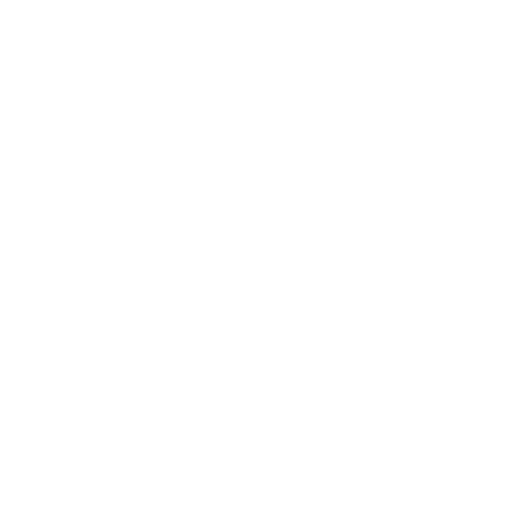

# Hi 👋, I'm Samarth Pagaria

I'm a Full-Stack & AI Engineer with 2+ years of experience building scalable web applications, now focused on the intersection of full-stack systems and AI Engineering.

* 🔭 I'm currently exploring context-aware RAG pipelines and agentic workflows.
* 🌱 I'm currently learning multi-agent orchestration with LangGraph and LangChain.
* 🤝 I'm looking to collaborate on agentic AI, autonomous systems, and production-grade full-stack applications.
* 💬 Ask me about full-stack architecture, RAG pipelines.
* ⚡ Open to collaborations, internships, or full-time roles where I can build something big in tech and contribute to the community.

<h3 align="left">🌐 Connect with me</h3>

  
  

<ul>
  <li>
    <a href="mailto:pagariasamarth@gmail.com">
      pagariasamarth@gmail.com
    </a>
  </li>
  <li>
    <a href="https://www.samarthpagaria.me/">Samarth Pagaria</a>
  </li>
</ul>

<h3 align="left">🛠️ Languages & Tools:</h3>

<!-- LangChain -->

<!-- LangGraph -->

<!-- Hugging Face -->

<!-- OpenRouter -->

<!-- Google Colab -->

<!-- TanStack -->

<!-- Zustand -->

<!-- Vercel -->

<!-- Render -->

